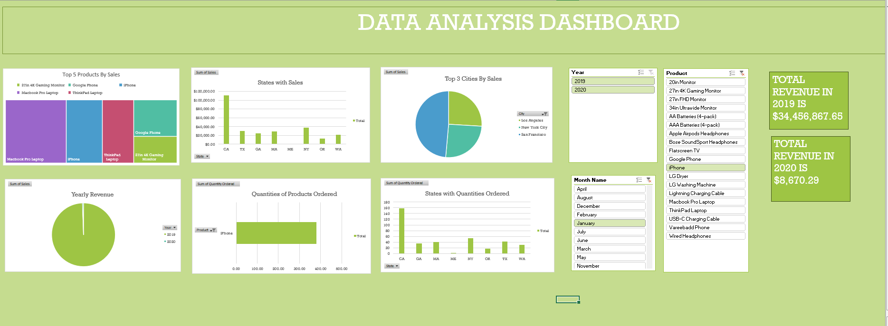

# Excel-Analysis-on-dynasty-shipping-company
This Dataset is all about a company that ships different products to various states and cities in the United State.
Steps Taken;
Imported the dataset into Excel
Transformed the data/ cleaned the data in power query
Used Pivot Table to analyze
Created a Dashboard for easy understanding
Added  slicers to filter through the dashboard
Added Cards to show real and single facts.

Download the full Excel Dashboard
The Complete interactive Excel File (with all sheets, pivots, and slicers) can be downloaded here;
[Download from Google Drive](https://drive.google.com/https://docs.google.com/spreadsheets/d/1s0R4mUvwI9sstVPThPPsdK3XV-8g-Mc_/edit?usp=drive_link&ouid=105453260144100514517&rtpof=true&sd=true)

